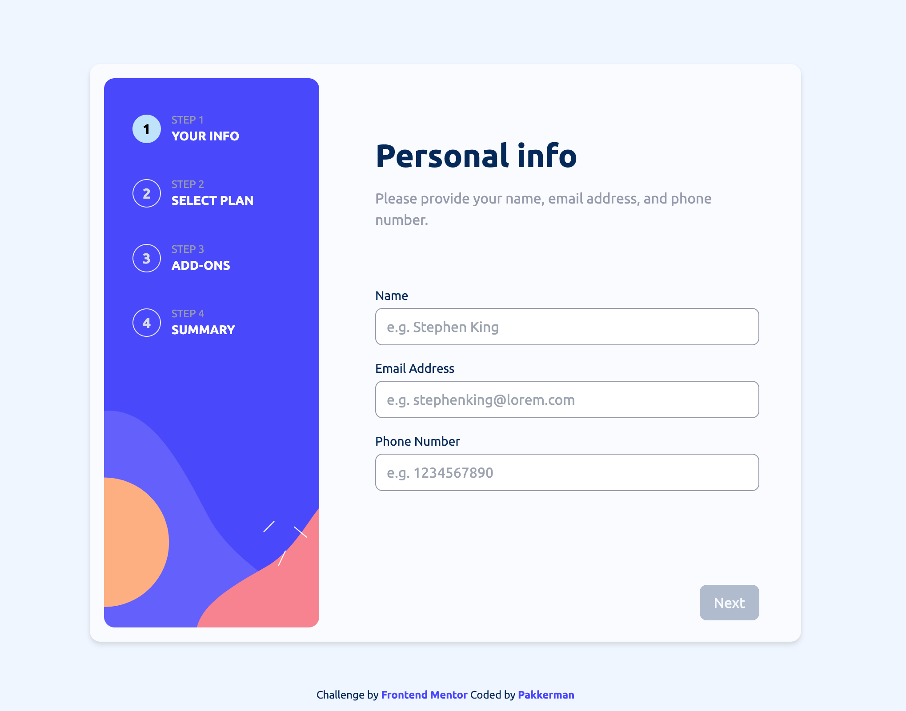

# Frontend Mentor - Multi-step From

This is a solution to the [Multi-step form](https://www.frontendmentor.io/challenges/multistep-form-YVAnSdqQBJ).

### Screenshots
  

    <h2>Mobile Screenshot</h2>
    

    <h2>Desktop Screenshot</h2>
    

### Solution Requirements

- [x] Complete each step of the sequence
- [x] Go back to a previous step to update their selections
- [x] See a summary of their selections on the final step and confirm their order
- [x] View the optimal layout for the interface depending on their device's screen size
- [x] See hover and focus states for all interactive elements on the page
- [x] Receive form validation messages if:
  - [x] A field has been missed
  - [x] The email address is not formatted correctly
  - [x] A step is submitted, but no selection has been made

### Modifications
- [x] Small transistion animations

### Tasks
- [x] **Layouts and Styling**
  - [x] Prograss bar for mobile and desktop
  - [x] Form Layout for mobile and desktop
  - [x] Bottom button section for mobile

- [x] **Form**
  - [x] Form and user input is kept in react context, prevent jumping steps
  - [x] Data persists when user navigate back to already filled out step
    - Step 1 Basic Info: 
      - [x] Text input validation and error feedback
    - Step 2 Plan Selection: 
      - [x] Radio input behaivor
      - [x] Chanege content upon switching billing cycle
    - Step 3 Addons: 
      - [x] Checkboxes input behavior
      - [x] Chanege content upon switching billing cycle
    - Step 4 Confirm order: 
      - [x] List all user input
      - [x] Calculate order total price based on user input and billing cycle
    Form navigations:
      - [x] next button available when the inputs are valid
      - [x] back button

- [x] **Routing** 
  - [x] Direct to thankyou page after form submit
  - [x] Redirect back to form if user on thank you page without input anything first

### Optimizations
- [x] Font preloading

### Learned
  - Layout mobile UI using min and max height, and dvh
  - Preloading Local font with nextjs
  - React Hook Form with Zod validation and infer types

### Links

- [Github repo](https://github.com/Pakkerman/multi-step-form)
- [Deployed on Vercel](https://pakkerman-multi-step-form-challenge.vercel.app/)

### Built with

- [Create T3 App](https://create.t3.gg/)
  - [Nextjs](https://nextjs.org/)
  - [React](https://react.dev/)
  - [TailwindCSS](https://tailwindcss.com/)
  - [react-hook-form](https://www.react-hook-form.com/)
  - [Zod](https://zod.dev/)

